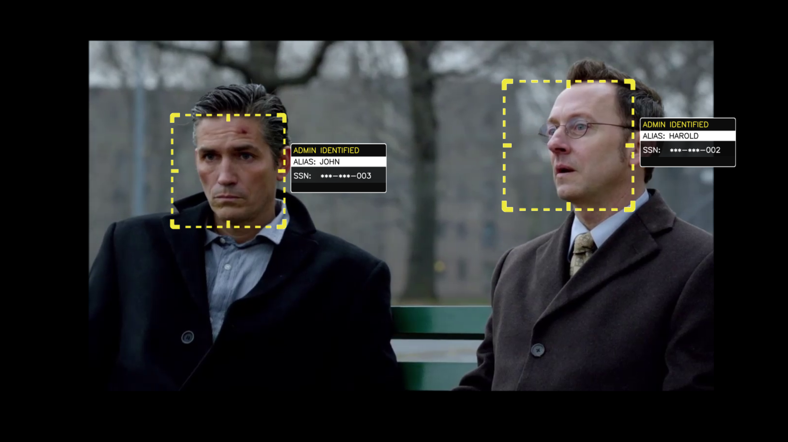

# The Machine
A Python program designed to emulate The Machine from [Person of Interest](http://www.imdb.com/title/tt1839578/?ref_=nv_sr_1).

This is a quick revamp I have done of the [original version](https://github.com/Jo-Dan/The-Machine) I made a few years ago in highschool. Its still far from perfect but it should be functional, easier to set up, and it no longer relies on an internet connection.



### What does it do?
It simulates the visual interface of The Machine. To accomplish this it uses [DeepFace](https://github.com/serengil/deepface) for face recognition and accepts voice commands, with randomly selected voices used in its responses. *(I have included some of the words in random voices from the original project but any that aren't included will be generated by your computers built in text-to-speech voices)*


### Installation and Use
#### The easy way
1. Install [Python 3](https://www.python.org/downloads/)  (must be Python 3.7 or higher)
2. Run `pip install -r requirements.txt`  
3. Install [AVbin](http://avbin.github.io/) (for voice command mode, not required if you don't activate voice mode)
4. Configure the system database following the below instructions
5. Run `python machine.py` to start the program

#### The manual way
Install everything manually (see [Dependencies](https://github.com/Jo-Dan/The-Machine/blob/master/README.md#dependencies) below)

### Detailed info
#### Reddit
The original project discussion can be found on [this thread on /r/PersonOfInterest](https://www.reddit.com/r/PersonOfInterest/comments/4suknb/the_machine_program_python/)

#### Face training
To train it to recognize your face, place photos of your face into "/facebase/1/", following the naming scheme "facebase/**{subjectnumber}**/**{filename}**.jpg" (e.g. "facebase/1/haroldpic.jpg"). 

Next you will need to update the subjects.csv file (see more details in the 'designations' section) to add the user to the system, this will only need to be done manually on the first run, after that you can change designations and add users using commands in the program. 

Now run the program


#### Designations
The program stores user info (asset number, name and designation) in the subjects.csv file, which can be edited in any spreadsheet program (or notepad, but the formatting is a little harder to understand). The designations are: ADMIN, ANALOG, USER (my current term for indigo agents), THREAT, and UNKNOWN (my stand in for "irrelevant").

When editing this file you must leave the first row as is (with the headings) and start your subjects from the second row onwards (so subject 1's info would be on row 2)

If you are an ADMIN or ANALOG you can also change a subject's designation using the command ```set {name} as {designation}```. For example if I was to type ```set finch as admin```, the program would find the subject with the name finch and set them as an admin.

#### Info
Typing the command "info" into the console (you must be an ADMIN or ANALOG to use this command) will bring up an information box next to the identified face on the camera stream, similar to the one in the last season.

Typing the command "status" into the console (you must be an ADMIN or ANALOG to use this command) will bring up a status box containing the program uptime and number of subjects detected.

#### Voice
If you are an ANALOG interface or an ADMIN you can type "voice" into the console, this activates the voice command mode, this essentially allows you to use any other command via speech recognition. To go back to typing simply give the command "voice" again.

The program saves mp3 files of each individual word it says, meaning each only needs to be generated once.

#### Exit
To exit the program simply type (or say, if you are in voice mode) "exit".

### Troubleshooting

- If you get this error:
  > "Error: Invalid Camera selection, try a different number"
  
  Try increasing your webcam number until it works.  
&nbsp;
- If you encounter any problems not listed here, just open an issue.

### Dependencies
[Python 3.7+](https://www.python.org/downloads/) is required.

#### Speech

| Package/module 								| pip command 								|
| --------------------------------------------- | ----------------------------------------- |
| pyglet (requires [AVbin](http://avbin.github.io/)) 	| `pip install pyglet` 						|
| speech_recognition 							| `pip install SpeechRecognition` 			|
| pocketsphinx                                  | `pip install pocketsphinx`                |
| natural.text 									| `pip install natural` 					|
| pyttsx3 										| `pip install pyvona` 						|
| num2words 									| `pip install num2words` 					|

#### Face Recognition

| Package/module 								| pip command 								|
| --------------------------------------------- | ----------------------------------------- |
| Pillow 										| `pip install Pillow` 						|
| numpy 										| `pip install numpy` 						|
| deepface                                      | `pip install deepface`                    |
| opencv 										| `pip install opencv_python` 						|
| opencv_contrib                                | `pip install opencv_contrib_python`                    |

